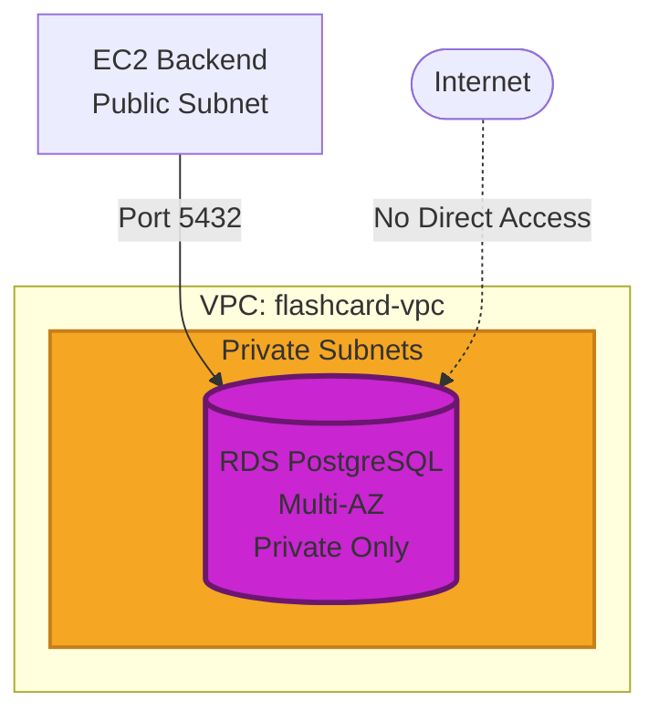

# Triển khai Cơ sở dữ liệu (AWS RDS)

## Tổng quan

AWS RDS (Relational Database Service) là dịch vụ cơ sở dữ liệu quan hệ được quản lý hoàn toàn. Trong phần này, chúng ta sẽ tạo RDS PostgreSQL instance để lưu trữ dữ liệu flashcard, thông tin người dùng và tiến trình học tập.

**Mục tiêu:**
- Tạo DB Subnet Group cho RDS
- Tạo RDS PostgreSQL instance trong Private Subnet
- Cấu hình Security Group cho database
- Migrate database schema và seed dữ liệu mẫu

---

## Kiến trúc RDS



**Lợi ích của Private Subnet:**
- Database không thể truy cập trực tiếp từ Internet
- Chỉ EC2 Backend mới kết nối được
- Giảm thiểu nguy cơ tấn công

---

## Bước 1: Tạo DB Subnet Group

**DB Subnet Group** là nhóm các subnet mà RDS có thể sử dụng để deploy database.

### 1.1. Truy cập RDS Dashboard

1. Mở AWS Console → Tìm dịch vụ **RDS**
2. Vào **Subnet groups** (menu bên trái)
3. Click **Create DB subnet group**


**[TODO: Chụp screenshot RDS Dashboard]**

---

### 1.2. Cấu hình Subnet Group

**Subnet group details:**

| Tham số | Giá trị | Giải thích |
|---------|---------|------------|
| **Name** | `flashcard-db-subnet-group` | Tên subnet group |
| **Description** | `Subnet group for Flashcard RDS` | Mô tả |
| **VPC** | `flashcard-vpc` | VPC đã tạo ở bước trước |

**Add subnets:**

1. **Availability Zones:** Chọn 2 AZs:
   - `ap-southeast-1a`
   - `ap-southeast-1b`

2. **Subnets:** Chọn 2 **Private Subnets**:
   - `flashcard-subnet-private1-ap-southeast-1a` (10.0.101.0/24)
   - `flashcard-subnet-private2-ap-southeast-1b` (10.0.102.0/24)

**Lưu ý:** Chọn Private Subnet, KHÔNG phải Public Subnet!

3. Click **Create**


**[TODO: Chụp screenshot cấu hình subnet group]**

---

## Bước 2: Tạo RDS PostgreSQL Database

### 2.1. Khởi tạo Database

1. Vào **RDS Dashboard** → **Databases**
2. Click **Create database**

---

### 2.2. Engine Options

**Choose a database creation method:**
- Chọn: **Standard create** (để có quyền kiểm soát đầy đủ)

**Engine options:**

| Tham số | Giá trị |
|---------|---------|
| **Engine type** | PostgreSQL |
| **Engine version** | PostgreSQL 15.x (hoặc latest) |


**[TODO: Chụp screenshot chọn PostgreSQL engine]**

---

### 2.3. Templates

**Templates:**
- Chọn: **Free tier** (nếu tài khoản đủ điều kiện)
- Hoặc: **Dev/Test** (nếu hết Free Tier)

**Lưu ý:** Free Tier chỉ áp dụng cho tài khoản mới trong 12 tháng đầu.

---

### 2.4. Settings

**DB instance identifier:**
- Name: `flashcard-db`

**Credentials Settings:**

| Tham số | Giá trị | Lưu ý |
|---------|---------|-------|
| **Master username** | `postgres` | Username mặc định |
| **Master password** | `<YOUR-SECURE-PASSWORD>` | Tạo mật khẩu mạnh |
| **Confirm password** | `<YOUR-SECURE-PASSWORD>` | Nhập lại mật khẩu |

**Gợi ý mật khẩu mạnh:**
```
FlashCard2024!SecureDB
```

**Quan trọng:** Lưu mật khẩu này vào nơi an toàn! Bạn sẽ cần nó để kết nối database.

---

### 2.5. Instance Configuration

**DB instance class:**

**Nếu chọn Free Tier:**
- Class: `db.t3.micro` (hoặc `db.t2.micro`)
- 1 vCPU, 1 GB RAM

**Nếu Dev/Test:**
- Class: `db.t3.micro`

---

### 2.6. Storage

**Storage:**

| Tham số | Giá trị |
|---------|---------|
| **Storage type** | General Purpose SSD (gp3) |
| **Allocated storage** | 20 GiB (Free Tier max) |
| **Enable storage autoscaling** | ❌ Uncheck (để tránh phí) |

---

### 2.7. Connectivity (Quan trọng!)

**Compute resource:**
- Chọn: **Don't connect to an EC2 compute resource** (chúng ta sẽ cấu hình thủ công)

**Network type:**
- Chọn: **IPv4**

**Virtual private cloud (VPC):**
- Chọn: `flashcard-vpc`

**DB Subnet group:**
- Chọn: `flashcard-db-subnet-group` (vừa tạo ở bước 1)

**Public access:**
- Chọn: **No** (Quan trọng! Database không public)

**VPC security group:**
- Chọn: **Choose existing**
- Security group: Chọn `flashcard-db-sg`
- Bỏ chọn `default` security group

**Availability Zone:**
- Chọn: **No preference** (AWS tự động chọn)


**[TODO: Chụp screenshot Connectivity settings]**

---

### 2.8. Database Authentication

**Database authentication:**
- Chọn: **Password authentication** (đơn giản nhất)

---

### 2.9. Additional Configuration

**Database options:**

| Tham số | Giá trị |
|---------|---------|
| **Initial database name** | `flashcard_db` |
| **DB parameter group** | default.postgres15 |
| **Option group** | default:postgres-15 |

 **Quan trọng:** Nhập **Initial database name** là `flashcard_db`. Nếu bỏ trống, RDS sẽ không tạo database mặc định!

**Backup:**
- Enable automated backups
- Backup retention period: **7 days** (Free Tier)
- Backup window: **No preference**

**Encryption:**
- Enable encryption (khuyến nghị)

**Monitoring:**
- Enable Enhanced Monitoring (optional, phát sinh phí nhỏ)
- Granularity: 60 seconds

**Maintenance:**
- Enable auto minor version upgrade
- Maintenance window: **No preference**

---

### 2.10. Estimate Cost và Create

1. Xem **Estimated monthly costs** (nếu có)
2. Click **Create database**
3. Chờ khoảng **5-10 phút** để RDS khởi tạo

**Status sẽ thay đổi:**
- `Creating` → `Backing up` → `Available`


**[TODO: Chụp screenshot RDS đang creating]**

---

## Bước 3: Lấy RDS Endpoint

### 3.1. Xem Database Details

1. Khi RDS chuyển sang **Available**, click vào DB instance `flashcard-db`
2. Tab **Connectivity & security**
3. Ghi lại **Endpoint** và **Port**

**Ví dụ:**
```
Endpoint: flashcard-db.c1234567890.ap-southeast-1.rds.amazonaws.com
Port: 5432
```


**[TODO: Chụp screenshot Endpoint]**

**Lưu Endpoint này! Sẽ dùng để kết nối từ EC2 Backend.**

---

## Bước 4: Cập nhật Backend .env

### 4.1. SSH vào EC2 Backend

```bash
ssh -i ~/.ssh/flashcard-backend-key.pem ubuntu@<EC2-Public-IP>
```

---

### 4.2. Cập nhật file .env

```bash
cd ~/fcj-workshop-template/backend
nano .env
```

**Cập nhật các dòng sau:**
```env
DB_HOST=flashcard-db.c1234567890.ap-southeast-1.rds.amazonaws.com
DB_PORT=5432
DB_NAME=flashcard_db
DB_USER=postgres
DB_PASSWORD=FlashCard2024!SecureDB
```

**Thay thế:**
- `DB_HOST` → RDS Endpoint của bạn
- `DB_PASSWORD` → Mật khẩu bạn đã đặt khi tạo RDS

**Lưu file:** `Ctrl + O` → Enter → `Ctrl + X`

---

### 4.3. Restart Backend

```bash
pm2 restart flashcard-backend
pm2 logs flashcard-backend
```

**Kết quả mong đợi:**
```
 Database connected successfully!
Server is running on port 5000
```

**Backend đã kết nối thành công với RDS!**

---

## Bước 5: Khởi tạo Database Schema

### 5.1. Chạy Migration

**[TODO: Cập nhật lệnh migration theo project thực tế]**

```bash
cd ~/fcj-workshop-template/backend
npm run db:migrate
```

**Hoặc chạy SQL script trực tiếp:**
```bash
# Cài PostgreSQL client
sudo apt install -y postgresql-client

# Kết nối RDS và chạy schema
psql -h flashcard-db.c1234567890.ap-southeast-1.rds.amazonaws.com \
     -U postgres \
     -d flashcard_db \
     -f database/schema.sql
```

**Nhập password khi được hỏi.**

---

### 5.2. Chạy Seed Data (Nạp dữ liệu mẫu)

```bash
npm run db:seed
```

**Hoặc:**
```bash
psql -h <RDS-ENDPOINT> -U postgres -d flashcard_db -f database/seed.sql
```

---

### 5.3. Xác nhận Data đã có trong DB

```bash
# Kết nối PostgreSQL
psql -h <RDS-ENDPOINT> -U postgres -d flashcard_db

# Liệt kê tables
\dt

# Xem dữ liệu
SELECT * FROM topics LIMIT 5;
SELECT * FROM cards LIMIT 5;

# Thoát
\q
```


**[TODO: Chụp screenshot kết quả query]**

---

## Bước 6: Test API với Database

### 6.1. Test từ Browser

```
http://<EC2-Public-IP>:5000/api/topics
http://<EC2-Public-IP>:5000/api/cards
```

**Kết quả mong đợi:**
```json
{
  "success": true,
  "data": [
    {
      "id": 1,
      "name": "Animals",
      "description": "Animal vocabulary",
      "icon_url": "..."
    }
  ]
}
```

---

### 6.2. Test từ Curl

```bash
curl http://<EC2-Public-IP>:5000/api/cards?topic=1
```

---

## Ghi chú Thông tin RDS

**Lưu vào file `rds-info.txt`:**

```txt
RDS PostgreSQL Information
==========================

DB Identifier: flashcard-db
Engine: PostgreSQL 15.x
Instance Class: db.t3.micro
Storage: 20 GiB gp3

Endpoint: flashcard-db.c1234567890.ap-southeast-1.rds.amazonaws.com
Port: 5432
Database Name: flashcard_db
Master Username: postgres
Master Password: [SAVE SECURELY]

VPC: flashcard-vpc
Subnet Group: flashcard-db-subnet-group
Security Group: flashcard-db-sg
Public Access: No (Private only)

Availability Zone: ap-southeast-1a
Multi-AZ: No (Free Tier)
Backup Retention: 7 days
Encryption: Enabled

Connection String (Backend):
postgresql://postgres:<PASSWORD>@<ENDPOINT>:5432/flashcard_db
```

**[TODO: Điền thông tin thực tế]**

---

## Khắc phục Sự cố

### Lỗi: "Could not connect to server: Connection timed out"

**Nguyên nhân:** Security Group không cho phép EC2 kết nối

**Giải pháp:**
1. Vào **Security Groups** → `flashcard-db-sg`
2. Inbound rules → PostgreSQL (5432)
3. Source phải là: `flashcard-backend-sg` (Security Group, không phải IP!)

---

### Lỗi: "password authentication failed for user 'postgres'"

**Nguyên nhân:** Sai password hoặc username

**Giải pháp:**
- Kiểm tra lại password trong file `.env`
- Đảm bảo username là `postgres`

---

### Lỗi: "FATAL: database 'flashcard_db' does not exist"

**Nguyên nhân:** Không nhập **Initial database name** khi tạo RDS

**Giải pháp:**
```bash
# Kết nối database mặc định 'postgres'
psql -h <RDS-ENDPOINT> -U postgres -d postgres

# Tạo database mới
CREATE DATABASE flashcard_db;

# Thoát và kết nối lại
\q
psql -h <RDS-ENDPOINT> -U postgres -d flashcard_db
```

---

## Checklist

- [ ] Đã tạo DB Subnet Group với 2 Private Subnets
- [ ] RDS instance đã được tạo với engine PostgreSQL
- [ ] Public access: No (Private only)
- [ ] Security Group: flashcard-db-sg
- [ ] Initial database name: flashcard_db
- [ ] RDS status: Available
- [ ] Đã lưu Endpoint và Password
- [ ] Backend .env đã cập nhật DB_HOST
- [ ] Backend restart thành công và kết nối DB
- [ ] Đã chạy migration (tạo tables)
- [ ] Đã chạy seed (nạp dữ liệu mẫu)
- [ ] Test API trả về data từ database

---

## Ước tính Chi phí

| Resource | Cấu hình | Chi phí |
|----------|----------|---------|
| RDS db.t3.micro | 1 instance, Single-AZ | $15-20/tháng (Free Tier: 750h) |
| Storage gp3 | 20 GB | $2.30/tháng (Free Tier: 20GB) |
| Backup storage | 20 GB | $0 (Free Tier: DB size) |
| **TỔNG** | | **~$3/tháng** (trong Free Tier)<br/>**~$18/tháng** (ngoài Free Tier) |

---

## Tiếp theo

Database đã sẵn sàng! Bây giờ chuyển sang [Phần 6: Hosting Frontend & API Gateway](../5.6-amplify-apigateway/) để đưa giao diện web lên AWS Amplify! 
